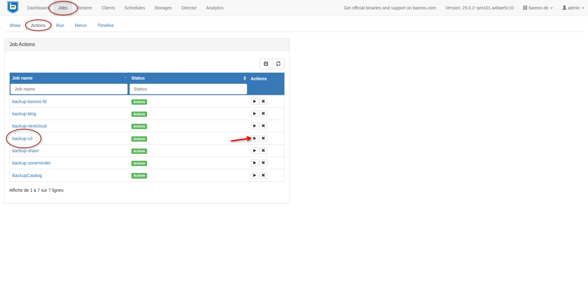
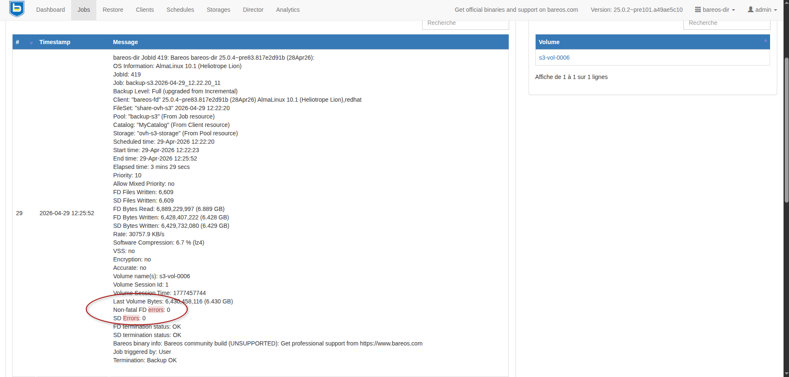
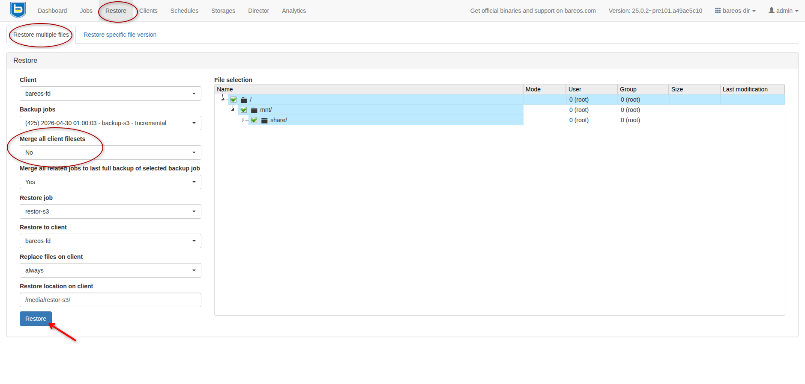
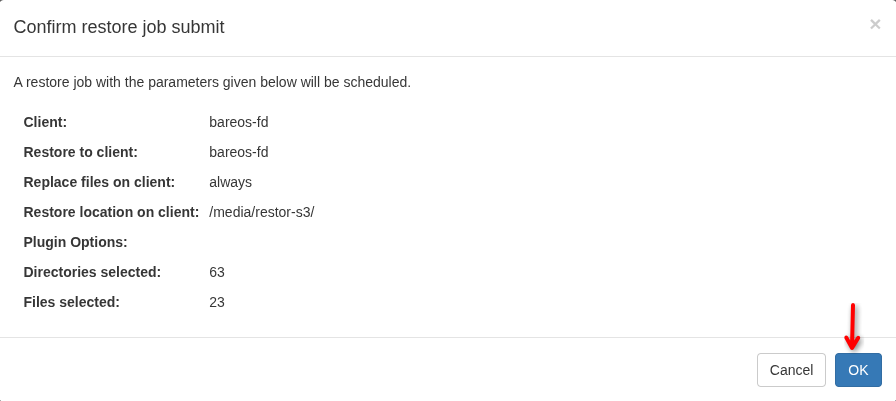
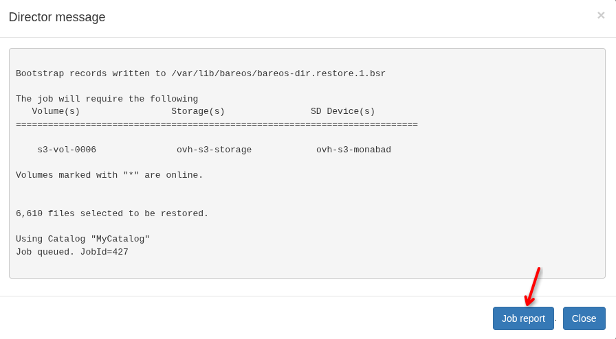
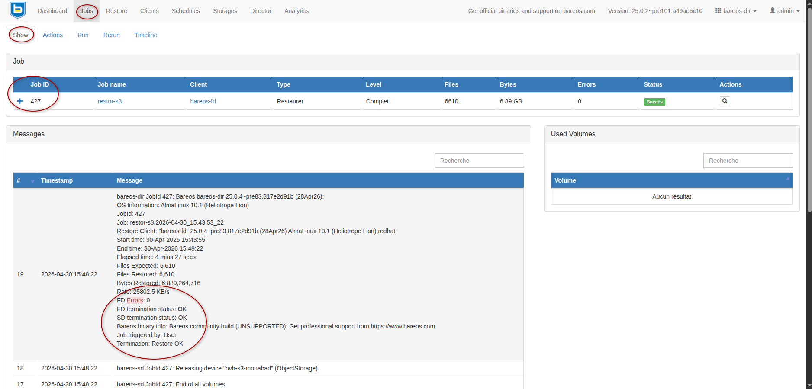

# Ajout d'un stockage de type OVH Object Storage (s3) sur un serveur Bareos

---

## Objectifs

- Mettre en place une sauvegarde automatisée depuis un stockage local vers un conteneur d'objets OVH
- Garantir le chiffrement des données lors des connexions entre les serveurs
- Optimiser les performances des transferts de données
- Réaliser un test de restauration des données

---

## Contexte

- Un serveur Bareos déjà configuré et fonctionnel (voir [mon article sur la mise en place d'un serveur Bareos](https://www.monabad.fr/home/utiliser-un-disque-nvme-tcp-servi-par-un-serveur-truenas-sur-une-solution-de-sauvegarde-bareos))
- Le serveur Bareos est en version 25.02 et est installé sur un système Alma Linux 10 dans ce lab
- Un compte actif chez OVH pour la création du stockage dans le cloud

---

## Création du conteneur d'objets via l'interface d'administration d'OVH

1. Depuis l'interface d'administration d'OVH, onglet: `Public Cloud`

- Sélectionner `Object Storage` dans le sous-menu `Storage`
- Créer un nouveau conteneur d'objets en ajustant les options selon les besoins
- Un utilisateur devra être créé si le compte n'en dispose pas encore
**Noter les informations de connexions de l'utilisateur**
- Activer le chiffrement de type "SSE-OMK" afin de laisser le soin à OVH de gérer le chiffrement des données
**Il est possible de gérer le chiffrement des données en local avec Bareos avant l'envoi sur le serveur mais cela implique une gestion séparée des clients File Daemon**

2. Le conteneur d'objet créé sera maintenant identifié comme un bucket

- Depuis l'onglet `Informations générales` du nouveau bucket, identifier ses attributs
- Il sera nécessaire de connaître les éléments suivants: `Nom du bucket` et "Endpoint" pour la suite de la configuration

---

## Configuration du serveur Bareos

### Installation des paquets nécessaires

```bash
sudo -i
dnf install bareos-storage-dplcompat s3cmd -y
```

### Edition du fichier de configuration s3cfg pour Bareos

```bash
vim /etc/bareos/s3cfg
```
```
[default]
access_key = "clé d'accès de l'utilisateur OVH créé précédemment "
secret_key = "clé secrète de l'utilisateur OVH créé précédemment "
host_base = s3.gra.cloud.ovh.net # doit correspondre à l'adresse du Endpoint identifiée précédemment 
host_bucket = %(bucket)s.s3.gra.io.cloud.ovh.net # en ajoutant un .io à l'adresse précédente si échec de la connexion
use_https = True
# Option pour OVH
signature_v2 = False
```

Appliquer des permissions strictes sur ce fichier qui contient des données sensibles
```bash
chown bareos:bareos /etc/bareos/s3cfg
chmod 640 /etc/bareos/s3cfg
```

Test de connexion
```bash
s3cmd --config=/etc/bareos/s3cfg --verbose ls -H s3://nom_du_bucket/
```
Ne doit pas renvoyer d'erreur

### Configuration du serveur Bareos pour l'utilisation de ce nouvel espace de stockage

1. Création de la configuration du device

- Ajout du fichier `/etc/bareos/bareos-sd.d/device/ovh-s3-homelab.conf`

```
Device {
  Name = ovh-s3-homelab
  Media Type = dplcompat
  Archive Device = Object Storage
  Device Type = dplcompat
  Device Options = "iothreads=4,ioslots=2,chunksize=262144000,program=s3cmd-wrapper.sh,s3cfg=/etc/bareos/s3cfg,bucket=tan-ovh-homelab"
  Label Media = yes
  Random Access = yes
  Automatic Mount = yes
  Removable Media = no
  Always Open = no
}
```

**Ajuster les paramètres en fonction des besoins et des ressources disponibles**
- `iothreads` &rarr; nombre de threads d’upload, un nombre élevé améliore les performances  mais nécessite plus de ressources CPU, RAM et bande passante. Valeur à définir entre 4 et 12.
- `ioslots` &rarr; taille de la file d’attente par thread, un nombre élevé améliore les performances  mais consomme plus de RAM. Valeur à définir entre 2 et 6.
- `chunksize` &rarr; taille des éléments créés par bareos pour tronquer la sauvegarde en plusieurs fichiers de taille identique. Valeur à définir entre 262144000 (250Mo) et 2147483648 (2Go)


2. Création de la configuration du storage

- Ajout du fichier `/etc/bareos/bareos-dir.d/storage/ovh-s3-storage.conf`

```
Storage {
  Name = ovh-s3-storage
  Address = 127.0.0.1 # ajuster selon l'IP du Storage Daemon
  Password = @/etc/bareos/secrets/dir-sd-pass.conf
  Device = ovh-s3-homelab
  Media Type = dplcompat
  Maximum Concurrent Jobs = 3

  TLS Enable = yes
  TLS Require = yes

  TLS Certificate = /etc/bareos/tls/srv-bareos.home.lab.crt
  TLS Key = /etc/bareos/tls/srv-bareos.home.lab.key
  TLS CA Certificate File = /etc/bareos/tls/ca.crt
}
```

3. Création de la configuration du pool

- Ajout du fichier `/etc/bareos/bareos-dir.d/pool/backup-s3.conf`

```
Pool {
  Name = backup-s3
  Pool Type = Backup
  Recycle = yes
  AutoPrune = yes
  Volume Retention = 90 days
  Label Format = "s3-vol-"
  Storage = ovh-s3-storage
  Maximum Volume Bytes = 10G
}
```

### Mise en place d'une sauvegarde à destination du stockage s3

1. Création de la configuration du fileset

- Ajout du fichier `/etc/bareos/bareos-dir.d/fileset/test-ovh-s3.conf`

```
FileSet {
  Name = "test-ovh-s3"
  Include {
    Options {
      Signature = SHA256
      Compression = LZ4
      One FS = yes
      Ignore Case = yes
    }
    File = /mnt/share/
      }
  Include {
    Options {
      wildfile = "*.cache"
      Exclude = yes
      }
  }
}
```

2. Création de la configuration du job

- Ajout du fichier `/etc/bareos/bareos-dir.d/job/backup-s3.conf`

```
Job {
  Name = "backup-s3"
  Type = Backup
  Level = Incremental
  Client = bareos-fd
  FileSet = "test-ovh-s3"
  Schedule = "daily-01h"
  Storage = ovh-s3-storage
  Pool = backup-s3
  Messages = Standard
  Priority = 10
}
```

### Test de la sauvegarde

- Depuis l'interface web du serveur Bareos

Onglets: `Jobs` &rarr; `Actions`

Lancer la sauvegarde immédiatement



Sélectionner l'ID du job pour afficher les détails

Onglets: `Jobs` &rarr; `Show`



Si la sauvegarde s'est déroulée correctement: `Termination: Backup OK`

### Test de la restauration

1. Création d'un job de restauration

- Création d'un dossier de restauration pour le test (optionnel)

```bash
sudo -i
mkdir /media/restor-s3
```

- Création du fichier `/etc/bareos/bareos-dir.d/job/restor-s3.conf`

```
Job {
  Name = "restor-s3"
  Description = "Restauration de la sauvegarde backup-s3"
  Type = Restore
  Client = bareos-fd
  FileSet = "test-ovh-s3"
  Storage = ovh-s3-storage
  Pool = backup-s3
  Messages = Standard
  Where = /media/restor-s3/
  Maximum Concurrent Jobs = 10
}
```

2. Test de la restauration

- Depuis l'interface web du serveur Bareos

Onglets: `Restore` &rarr; `Restore multiple files`

Si le client détient plusieurs jobs de sauvegarde &rarr; `Merge all client filesets` = `no`







- Il est possible de suivre l'avancement du job de restauration

```bash
tail -f /var/log/bareos/bareos.log
```

- Vérification du status de la restauration



Si la restauration s'est déroulée correctement: `Termination: Restore OK`

---

## Conclusion

- La mise en place d’un stockage OVH Object Storage (S3) comme destination de sauvegarde pour Bareos permet d’étendre un système de sauvegarde automatisée vers le cloud.
- Le chiffrement sur le canal de communication garantit la sécurisation des données durant les transferts et celui mis à disposition par OVH sur le stockage cloud est suffisant pour les cas d’usage courants.
- En ajustant les paramètres de performance (iothreads, ioslots, chunksize), le transfert peut être optimisé en fonction des ressources disponibles.
- L’intégration native avec le format « dplcompat » de Bareos optimise le découpage, le transfert et facilite la mise en place de la solution.